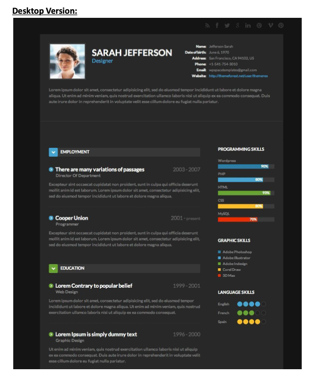

# from-design-to-website

## Table of Contents

* [Author](#author)
* [Project Link](#project-link)
* [Description](#description)
* [Technologies](#technologies)
* [Setup](#setup)
* [Original Design](#original-design)

## Author

* **Greg Reyes**

## Project Link

* https://gregreyes.dev/projects/from-design-to-website/

## Decription

A demonstration of collaborating with a designer and translating their design ideas into web compatible code from scratch, with a project deadline of 48 Hours.

## Technologies

HTML, CSS, Flexbox

## Setup

```sh
git clone https://github.com/gregoryreyes/from-design-to-website;
cd from-design-to-website;
```

## Original Design:

Images provided by designer that were used as a visual guide to create website.



